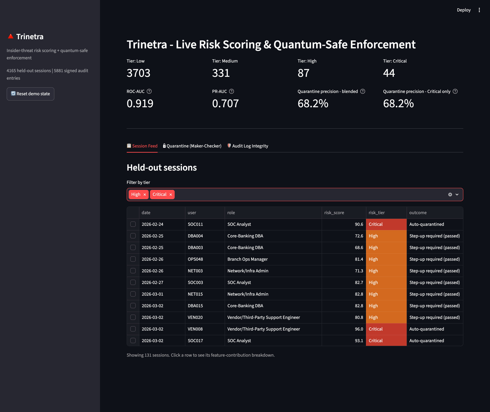
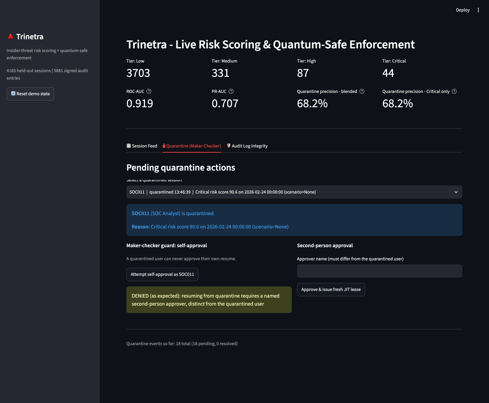
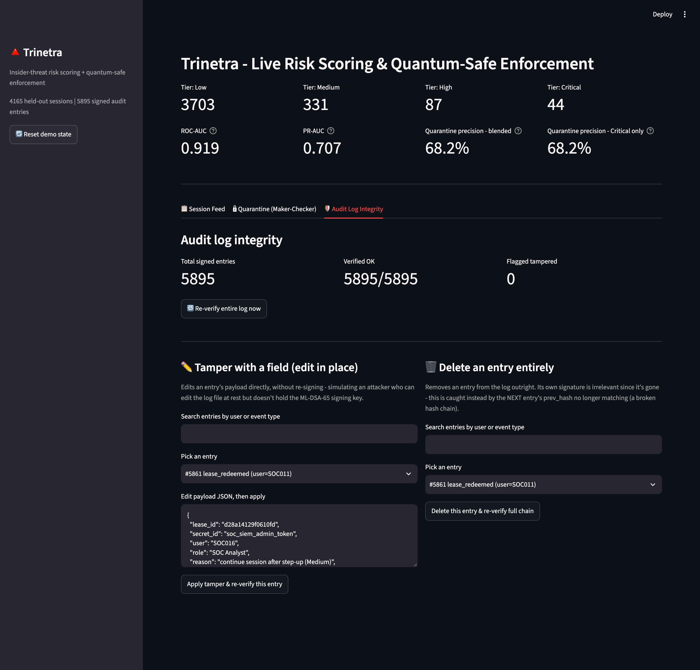
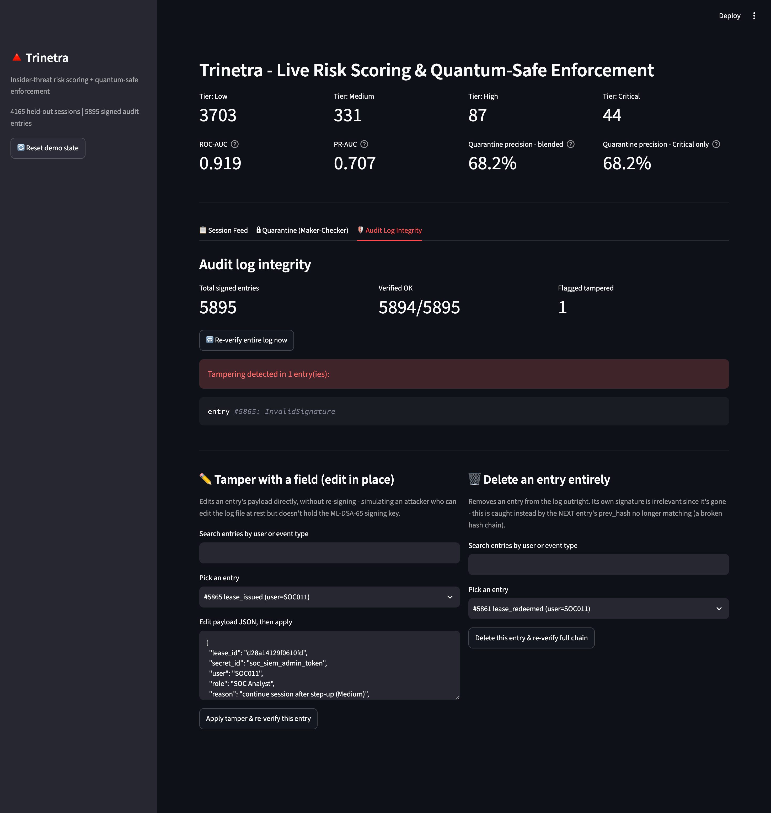
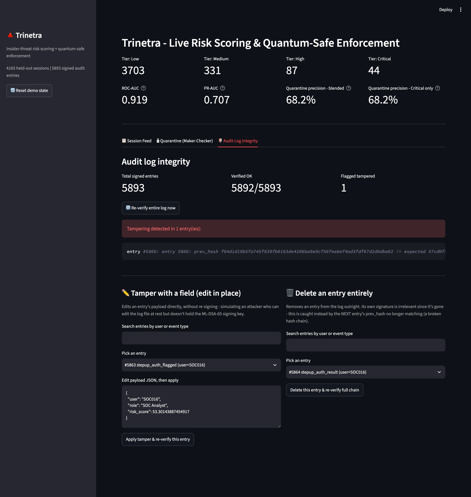

# Trinetra

AI-driven privileged access misuse & insider threat detection, with a real
post-quantum-secured vault and tamper-evident audit log.

Built for **FinSpark'26** (Bank of Maharashtra / IBA / Department of
Financial Services), Problem Statement 1: *Privileged Access Misuse &
Insider Threat Detection*.

**Live:** https://trinetra-dnii.onrender.com (free-tier server, can be slow
to cold-start - running it locally via the Quickstart below is faster and
recommended for actually evaluating it)

## What it does

Every privileged session (a DBA touching the core banking database, a
vendor engineer remoting in, a SOC analyst pulling records) is scored
independently, so each one is designed to be evaluated in real time as it
happens, using behavioral analytics rather than fixed rules. High-risk
sessions are handled with risk-based access control - step-up
authentication, or immediate auto-quarantine - instead of a standing,
always-on credential. Every credential handed out is a short-lived,
single-use, just-in-time lease. The vault that stores those credentials,
and the audit log that records every decision, are both protected with
real hybrid post-quantum cryptography (ML-KEM-768 + X25519, ML-DSA-65) -
not a claimed buzzword.

<p align="center">
  <a href="screenshots/screencapture-localhost-1.png">
    
  </a>

  <a href="screenshots/screencapture-localhost-2.png">
    
  </a>

  <a href="screenshots/screencapture-localhost-3.png">
    
  </a>

  <a href="screenshots/screencapture-localhost-4.png">
    
  </a>

  <a href="screenshots/screencapture-localhost-5.png">
    
  </a>
</p>

## Quickstart

The live dashboard is the actual product. The other two scripts are
standalone verification tools, not separate stages you need to run first.

```bash
pip install -r requirements.txt
streamlit run app.py
```

That one command runs the whole system together, live: detection,
risk-based response, the quantum-safe vault, and the signed audit log, all
in one dashboard. It calls the exact same underlying functions as the two
scripts below - it is not a different, fourth thing sitting after them.

```bash
python run_pipeline.py     # detection engine alone - verbose stats to terminal
python run_vault_demo.py   # vault + audit log + quarantine alone - live tamper-detection demo
```

These two exist so the detection quality and the security mechanics can
each be checked in isolation, with full printed output, without a browser
- exactly how each was verified during development. They are not "phase
1" and "phase 2" of the product; that was a build-sequencing choice made
during development, not the architecture of the final system.

No API keys, no external services, no cloud account needed. Runs fully
offline.

**On "real time":** the scoring itself is real-time-capable - each
session is scored independently, with no dependency on seeing a batch or
future data first, so a live incoming event could be scored the instant it
arrives. The demo above replays a fixed set of already-generated test
sessions through that same scoring logic rather than connecting to a live
production feed - an honest, reasonable scope for a prototype, and worth
stating precisely rather than implying more than that.

## Results (held-out test split, never seen during model fitting)

| Metric | Value |
|---|---|
| ROC-AUC | 0.9188 |
| PR-AUC | 0.7072 |
| Malicious sessions caught (Medium tier or above) | 36 / 43 (83.7%) |
| Held-out false positive rate (High-or-Critical) | 2.40% |
| Quarantine precision | 68.2% (30 of 44 auto-quarantined sessions were truly malicious) |

Full breakdown, per-scenario trajectories, and every other verified number
used in the pitch deck: [`trinetra_verified_numbers.md`](trinetra_verified_numbers.md).

## Baselining period, in production

Like any behavioral anomaly detector - this includes commercial UEBA
products such as Microsoft Defender for Identity, Exabeam, and Securonix,
which all work the same way - Trinetra needs an initial period of
activity to learn what "normal" looks like, per person and per role,
before it can meaningfully flag deviations from it. In this prototype,
that's the first 50 of 90 simulated days.

In a real deployment, this does **not** mean someone manually writes or
hand-curates a "clean" dataset. It means pointing the system at a recent
window of the bank's actual historical logs, as-is (roughly 2-4 weeks is
standard for this category of tool), and letting it build baselines
directly from that. This works without manual cleaning because insider
attacks are rare relative to total activity, so raw, unfiltered historical
logs are overwhelmingly normal by default - and both algorithms used here
(Isolation Forest, peer-group deviation) define "normal" as the majority
pattern, not a hand-verified ground truth, so they're inherently tolerant
of a small amount of contamination in that window rather than depending on
it being perfectly clean.

The honest limitation: if that baseline window happens to contain a
sustained, ongoing insider campaign, the model's sensitivity to that
specific pattern is somewhat reduced, since it partially gets absorbed
into what looks "normal" for that person or role. This is a known, general
limitation of unsupervised behavioral detection, not unique to this
system. The standard mitigations, used the same way in real UEBA
deployments, are: start a new deployment in observation-only mode before
enabling automated quarantine actions, refresh the baseline on a rolling
basis rather than once, and layer rule-based detections alongside the
behavioral model for known-bad patterns that don't need a baseline to
catch at all.

## Why the data is synthetic

The real CMU CERT Insider Threat dataset (r4.2) is a 4.82GB archive. Instead,
`trinetra/data/synthetic.py` generates a realistic stand-in with the same
shape - 140 users across 5 banking roles, 90 days of logon/device/file/
http/email events, and 6 hand-authored malicious scenarios mapped to
MITRE ATT&CK - so the detection approach can be validated end-to-end. The
feature pipeline (`trinetra/features/engineer.py`) is written to be
data-source-agnostic; pointing it at a bank's real logs later is a data-
loading change, not a redesign (see `USE_REAL_CERT_DATA` in `config.py`).

## Architecture

```
Privileged access event
        |
        v
Behavioral feature engineering (peer-group + sequence + timing)
        |
        v
AI risk engine (Isolation Forest + peer-group ensemble, capped explanation)
        |                                   |
        v                                   v
Risk-based response                 Quantum-safe vault (ML-KEM-768 + X25519)
(log / step-up / quarantine)                |
        |                                   v
        +----------------------> Signed, hash-chained audit log (ML-DSA-65)
                    |
                    v
            SOC analyst dashboard
```

## Project layout

```
config.py                      - every tunable setting, in one place
trinetra/data/                 - synthetic event generator + role profiles + loader
trinetra/features/engineer.py  - behavioral feature engineering
trinetra/model/                - Isolation Forest, peer-group model, calibration, ensemble
trinetra/scoring/risk_score.py - risk tiers, explainability, evaluation
trinetra/access_control/       - risk-tier policy (step-up/quarantine), quarantine-precision metrics
trinetra/vault/                - hybrid PQC vault, JIT leases, secrets store
trinetra/audit/log.py          - signed, hash-chained audit log
trinetra/pipeline.py           - end-to-end orchestration, train/test split
run_pipeline.py                - phase 1 CLI (detection)
run_vault_demo.py              - phase 2 CLI (vault + audit + quarantine)
app.py                         - Streamlit dashboard
```

## Why classical ML, not an LLM

"AI-driven" here means Isolation Forest and peer-group Mahalanobis distance,
not a large language model, and that's a deliberate choice:

- The problem is numerical (distance from a behavioral baseline), not
  linguistic - the right tool is a statistical outlier detector, not a
  language model.
- A bank needs deterministic, reproducible scoring for audit and compliance
  -- the same input must always produce the same decision. LLM output can
  drift between calls in ways a fixed calculation cannot.
- Running an LLM per privileged session, at real bank scale, indefinitely,
  is unnecessary cost and latency for a problem that doesn't need language
  understanding to solve.
- Feeding any attacker-influenced text (filenames, URLs) into an LLM that
  influences a security decision creates a prompt-injection surface. A
  statistical model over numeric features has no natural-language channel
  for an attacker to exploit.
- The feature-contribution breakdown is a direct readout of the actual
  computation that produced the score - not an LLM's plausible-sounding
  self-explanation, which is a well-documented gap.

Where an LLM would legitimately help: generating a natural-language
incident summary *from* an already-computed risk score, strictly
downstream of the decision, never influencing it. Noted as a roadmap item,
not implemented here.

## Security notes

- **Zero standing privilege** - every vault access is a fresh, short-TTL,
  single-use lease (`trinetra/vault/leases.py`).
- **Hybrid post-quantum encryption** - vault secrets are sealed with
  ML-KEM-768 combined with X25519 via HKDF-SHA384 into an AES-256-GCM key
  (`trinetra/vault/crypto.py`), so recovering a secret requires breaking
  both a post-quantum and a classical primitive.
- **Tamper-evident audit log** - every entry is individually ML-DSA-65
  signed and hash-chained (`trinetra/audit/log.py`). Editing a field breaks
  that entry's signature; deleting an entry breaks the hash-chain link to
  the next one. Both are independently demoed in `run_vault_demo.py`.
- **Maker-checker** - a quarantined user can never approve their own reinstatement; resuming requires a distinct, named second approver (`AccessControlPolicy.resume_from_quarantine`). Prototype scope, stated plainly: the approver is a typed name, checked only against "is this different from the quarantined user" — there is no integration with a real identity provider to verify the approver is who they claim to be, or that they hold an authorized role. A production deployment would require the approver to authenticate through the bank's existing SSO/IAM (the same one already used for their normal login) and would check that authenticated identity against an authorized-approver list (security team, or the user's actual manager, pulled from the bank's existing HR/AD hierarchy) before accepting the approval - the same pattern real PAM products (CyberArk, BeyondTrust) follow: integrate with existing identity infrastructure rather than build a separate one. Step-up authentication has the identical scope limitation - `simulate_stepup_auth` is a deterministic stand-in for an MFA challenge, not a real one, for the same reason.
- This is a hackathon prototype evaluated on synthetic proxy data, not
  production bank data - stated here explicitly rather than implied.
